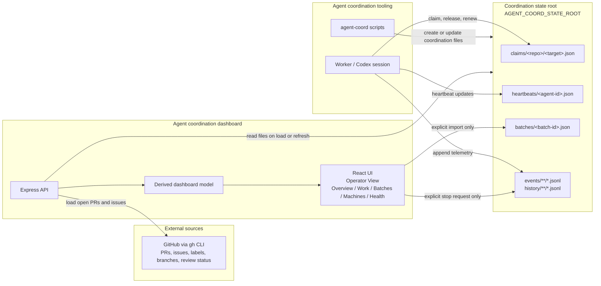
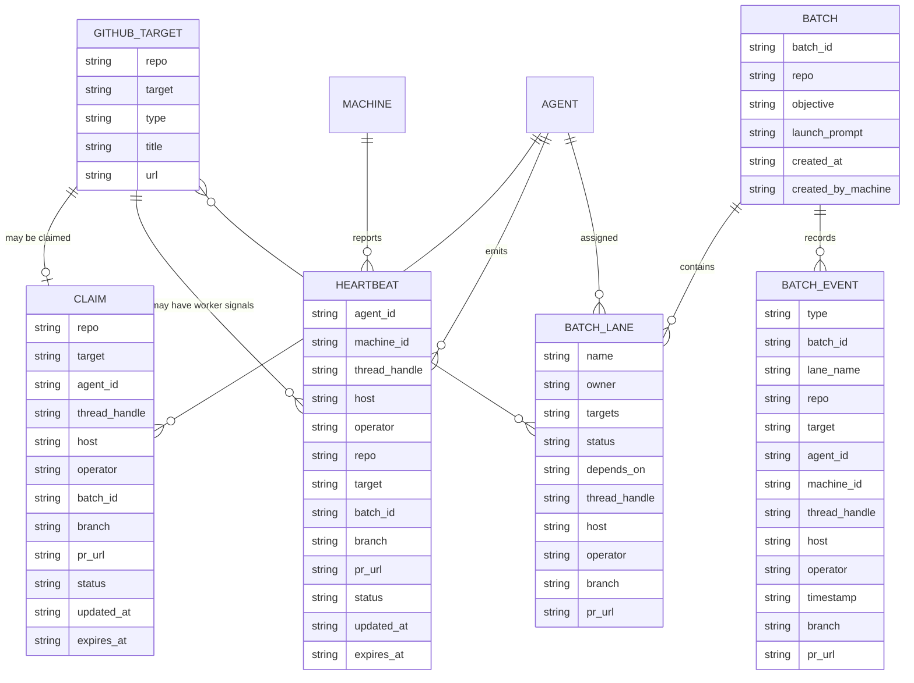
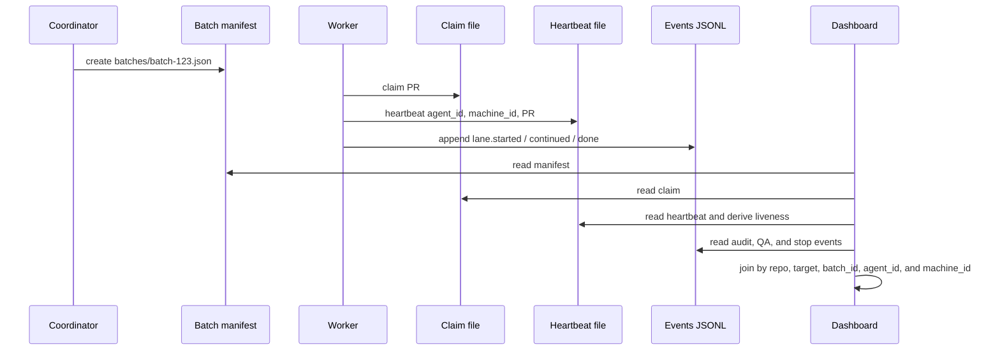

# Coordination Architecture

This dashboard joins GitHub work, coordination records, retained batch metadata,
and append-only history into one read model. The core relationship is: a PR or
issue is the target, a claim says who owns it, a heartbeat says whether that
worker is alive and which machine it is on, and a batch manifest/history
explains why that target belongs to a coordinated batch.

API mode reads the HTTP coordination backend and is the primary live
multi-machine operations mode. Filesystem mode reads the local coordination
state root and remains useful for local inspection, offline/recovery work,
demos, older roots, and tests.

## System Diagram



## Data Model



## Data Locations

The dashboard should run from the app repository, for example:

```bash
/Users/justin/src/agent-coordination-dashboard
```

The coordination data should live in a separate state root, for example:

```bash
/Users/justin/Documents/agent-coordination/agent-coordination-pr2
```

The state root should trend toward data-only:

| Directory | Purpose | Writer |
| --- | --- | --- |
| `claims/` | Current ownership for repo targets | Agent coordination tooling or workers |
| `heartbeats/` | Liveness, machine, target, and phase for agents | Worker heartbeat tooling |
| `batches/` | Retained batch manifests and launch prompts | Coordinator tooling or dashboard import |
| `events/` | Append-only batch and QA telemetry | Workers, coordinators, dashboard stop request |
| `history/` | Optional append-only historical telemetry | Workers or coordination tooling |

Executable helper scripts such as `agent-coord` should live in a tool repo, not
inside every coordination-state root. Keeping scripts in a tool repo and state
in the state root makes backup, audit, and dashboard scoping easier to reason
about.

## Storage Choice

The current filesystem store is intentionally simple:

- JSON files for current state such as claims, heartbeats, and batch manifests.
- JSONL files for append-only events and history.
- Plain directories so humans and agents can inspect, copy, repair, and audit
  state without a service dependency.

This is the right immediate fit for local coordination and small batch
workflows. A different store becomes worth evaluating when coordination needs
multi-user queries, retention policies, stronger transactions, or richer
reporting. The first alternative to evaluate should be SQLite because it can
preserve local ownership while adding indexes, transactions, and queryable
history. A networked database should wait until there is a clear multi-machine
coordination service boundary.

## Update Cadence

The dashboard is not currently a live event stream. It rebuilds its in-memory
model when the page loads, when the user refreshes, or after an explicit local
write such as importing a batch manifest or requesting a batch stop.

| Data | Where | Updated by | How often |
| --- | --- | --- | --- |
| Open PRs/issues | GitHub | Dashboard API reads through local `gh` CLI | On dashboard load or refresh |
| Claims | `claims/**/*.json` | `agent-coord claim/release` or worker tooling | When work is claimed, renewed, released, or expires |
| Heartbeats | `heartbeats/*.json` | Worker or heartbeat tooling | Periodically and at phase changes; liveness is derived from `expires_at` |
| Batch manifests | `batches/<batch-id>.json` | Coordinator tooling or dashboard import | Usually once before spawning workers, then rarely |
| Batch events/history | `events/**/*.jsonl`, `history/**/*.jsonl` | Workers and coordinators | Append at lifecycle moments |
| Stop requests | `events/batches/<batch-id>.jsonl` | Dashboard explicit button | Only when a user requests stop |
| QA validation | QA events in `events/` or `history/` | Separate QA worker or process | When QA is requested, started, passed, or failed |
| Dashboard model | Server memory | Dashboard API | Rebuilt on page load, manual refresh, API polling, and after explicit dashboard writes |

## Join Keys

The dashboard joins records by stable identity fields:

- `repo + target`: connects GitHub PRs/issues, claims, heartbeats, batch lane
  targets, and QA validation events.
- `agent_id`: connects a claim holder to a heartbeat and a machine.
- `machine_id`: groups active workers by machine.
- `thread_handle`, `operator`, and `host`: identify the human/operator thread
  context and host app. `host` is not a machine id.
- `batch_id`: connects claims, heartbeats, manifests, events, stop requests,
  and QA events to one batch.
- `lane_name` or lane owner: connects events and heartbeats to a planned lane
  when workers report lane identity.

If a batch manifest is missing, the dashboard can infer a batch card from
claims and heartbeats that share `batch_id`, but it marks that batch as
inferred and reports a health warning.

## PR In A Batch



In the UI, that one PR can appear in multiple contexts:

- **Operator View**: first-screen row keyed by repo/target, searchable by PR,
  issue, branch, thread, agent, machine, operator, host, or PR URL.
- **Overview**: active, recoverable, ready, missing QA, or needs attention.
- **Work**: target row grouped by scheduling state.
- **Batches**: lane target with batch lifecycle, launch prompt, and history.
- **Machines**: worker grouped under the reporting machine.
- **Health**: missing manifest, missing heartbeat, missing machine id, or other
  telemetry gaps.

## Dashboard Writes

The dashboard remains observability-first. It has only explicit, loopback-only
coordination writes:

- Save an imported retained batch manifest to `batches/<batch-id>.json`.
- Append a `batch.stop_requested` event to
  `events/batches/<batch-id>.jsonl`.

The dashboard does not launch agents, kill processes, release claims, edit
heartbeats, merge PRs, or modify code. Workers and coordination tooling must
honor stop-request events before stop/restart semantics become operationally
enforced.

## Viewing Diagrams

Codex chat may constrain Mermaid diagrams to the message column. For a larger
view, open this Markdown file in a full-width editor or GitHub Markdown preview,
then use browser zoom. The diagrams are source-controlled Mermaid blocks, so
they can also be rendered to SVG/PNG by any Mermaid-compatible documentation
tool if a full-screen artifact is needed.
