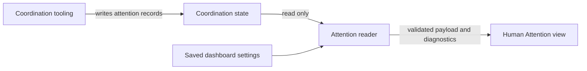

# Human Attention Architecture

The dashboard reads Human Attention records for the repositories and workspace
saved in its settings. It does not write coordination state.

```mermaid
flowchart LR
  Tooling[Coordination tooling] -->|writes attention records| State[Coordination state]
  State -->|read only| Reader[Attention reader]
  Settings[Saved dashboard settings] --> Reader
  Reader -->|validated payload and diagnostics| View[Human Attention view]
```

## Read Path

`GET /api/attention` builds the payload the view renders. The server reads from
the HTTP coordination API when `AGENT_COORD_API_URL` is configured. Otherwise,
it reads the local coordination state root. The reader bounds per-repository
entries, time, and record size. It returns source status and diagnostics for
unreadable or invalid data instead of changing the source.

The server caches a completed payload briefly and coalesces concurrent reads.
An hourly sampler reads through the same cache for its local assessment data.

## Scope

Settings persist the target repositories and attention workspace. A record must
match both before it can appear in the view. The settings API is writable only
from the machine that runs the dashboard. Remote viewers can read the attention
view but cannot alter its scope.

## Rendering Boundary

The server validates attention records against the vendored schema. The shared
projection then allowlists fields and validates rendered links. Provider-native
open URIs are navigation targets only; the dashboard never fetches them.

## Operational Boundaries

Coordination tooling owns record creation, refresh, and resolution. The
dashboard owns read-only presentation, local settings, and diagnostics. A
source failure is displayed as `UNKNOWN`; it does not trigger a repair,
replacement record, or other coordination mutation.
